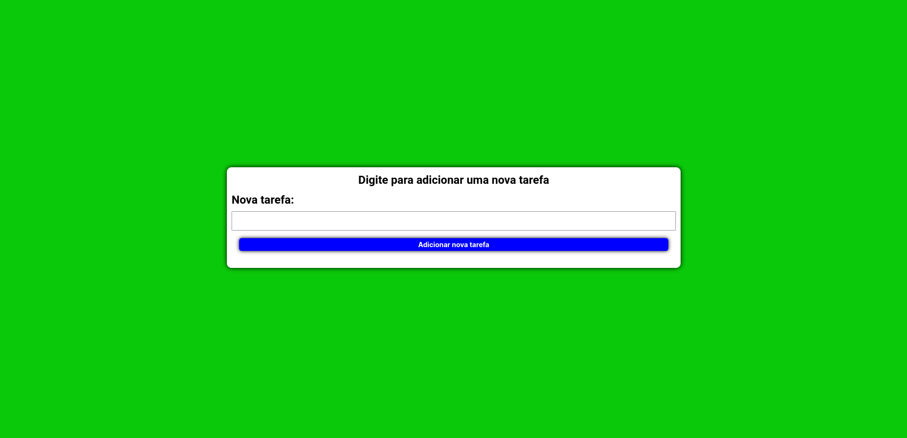

# To do list 📚

<!---Esses são exemplos. Veja https://shields.io para outras pessoas ou para personalizar este conjunto de escudos. Você pode querer incluir dependências, status do projeto e informações de licença aqui--->
<h1>
  Tecnologias 👨‍💻
  </br>
  </br>
  <div align="center">
    
    
    
    
  </div>
</h1>

<p align="center">
  
</p>

> Link da aplicação: <a href="https://drb-diego.github.io/to-do-list-react-styled-components/">To do list</a>


## 🖖🏼 Objetivo
O objetivo desse projeto é criar um app de lista de tarefas, exercitando algumas tecnologias que aprendi recentemente.
Como por exemplo, react e styled-components.
### Ajustes e melhorias

Projeto concluido ✅:

- [x] Adicionar novas Tasks
- [x] Ao clicar no "check" riscar a task
- [x] Ao clicar no "delete" poder remover a task

## 💻 Pré-requisitos

Antes de começar, verifique se você atendeu aos seguintes requisitos:
<!---Estes são apenas requisitos de exemplo. Adicionar, duplicar ou remover conforme necessário--->
* Ter instalado o nodeJs na versão **lts 16.13.0** ou **versões recentes**

## 🚀 Instalando To-do-list

Para instalar o To-do-list, siga estas etapas:

</br>

**Linux e macOS:**

**Clone o repositório**

```
  git clone https://github.com/Drb-Diego/to-do-list-react-styled-components.git
```

Depois execute os seguintes comando

**Caso yarn:**
```
  yarn
```
```
  yarn start
```

**Caso Npm:**
```
  npm install
```

```
  npm start
```

</br>


**Windows:**

**Clone o repositório**

```
  git clone https://github.com/Drb-Diego/to-do-list-react-styled-components.git
```

Depois execute os seguintes comando

**Caso yarn:**
```
  yarn
```
```
  yarn start
```
**Caso Npm:**
```
  npm install
```
```
  npm start
```

